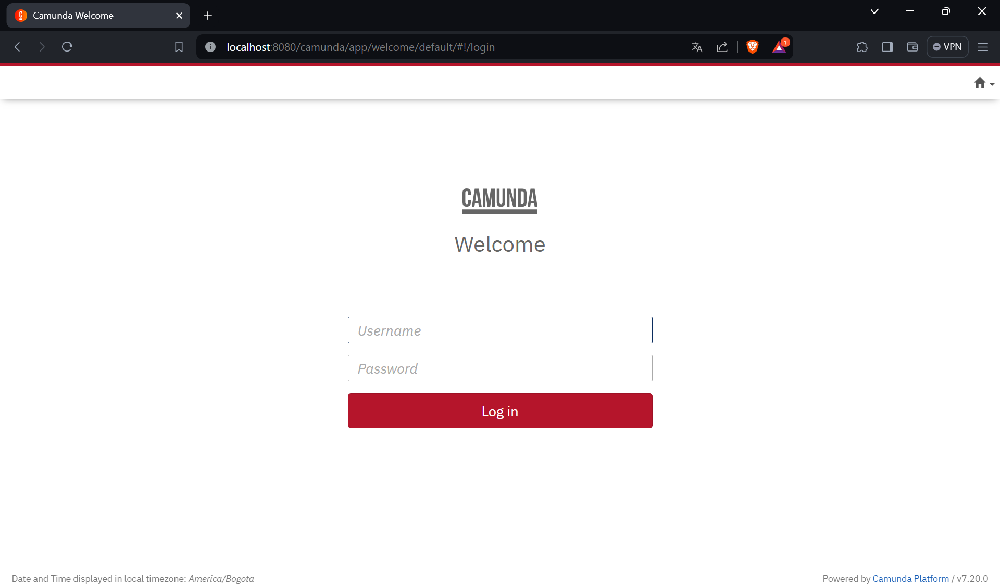

# Camunda-SPAD
Este repositorio integra una aplicación web en Spring Boot 3.1.1 con la máquina de procesos de Camunda 7 utilizando una base de datos PostgreSQL.


## Index

1. [Descripción](#Descripción)
2. [Prerrequisitos](#Prerrequisitos)
3. [Uso](#Uso)


## Descripción

Para la inicialización del proyecto de Spring Boot que integra la máquina de procesos de Camunda 7 se hace uso de la herramienta [Camunda Automation Platform 7 Initializr](https://start.camunda.com/)
la cual es facilita la creación del proyecto definiendo las dependencias necesairas para el correcto fucnionamiento.

Spring Boot es un marco de trabajo o framework que simplifica la creación de aplicaciones Java y el motor Camunda permite la ejecución y gestión de flujos de trabajo y procesos organizacionales.

Con el uso de esta herramienta permite a los desarrolladores comenzar a trabajar en aplicaciones de automatización de procesos organizacionales de manera eficiente y rápida.

## Prerrequisitos

Para usar este programa se necesita lo siguiente:

1. **Sistema control de versiones**: para integrar los cambios que se generen en el ciclo de desarrollo. Para instalar acceda a [GIT official website](https://git-scm.com/downloads).

2. **IntelliJ IDEA**: si desea realizar modificaciones al código fuente. Puede descargar IntelliJ en [IntelliJ official website](https://www.jetbrains.com/es-es/idea/download/?section=windows).

3. **Camunda Modeler**: para la visualización de los modelos de procesos de negocio que se estén diseñando e implementando. Puede descargar Camunda Modeler en [Camunda Modeler Official website](https://camunda.com/download/modeler/)

4. **Docker y Docker-Compose**: para la ejecución de los contenedores en los que corren las imágenes Docker del programa de Spring Boot y la instancia de la base de datos PostgreSQL  [Docker Desktop Official website](https://www.docker.com/products/docker-desktop/)

## Uso

To use this program in your local machine you must:
Para ejecutar el programa con Docker usted debe:

1. Clonar el repositorio en la carpeta o directorio de su elección, con el comando: 

   ```
   https://github.com/dnunez-ic/Camunda-SPAD-IoT.git
   ```
2. Dentro de la carpeta **Camunda-SPAD-IoT** ejecutar el comando:
   ```
   docker-compose up
   ```
    Tenga en cuenta que debe tener ejecutando el proceso demonio de Docker.

3. El programa funciona en el puerto 8080, abra un navegador acceda a la dirección:
    ```
   http://localhost:8080
   ```
   
5. Las credenciales para autenticarse son:
    ```
   user: demo
   pass: demo

   ```
   
6. Listo! Puede utilizar la máquina de procesos de Camunda.
   